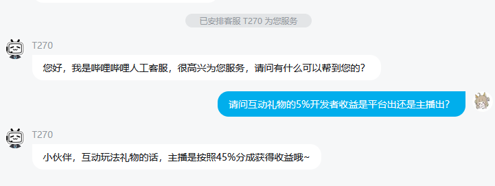

### 倒计时（倒计时所有单位都是秒）

- **加时/减时**：赠送设定的礼物可以增加/减少总时长
- **加倍/减半**：赠送设定的礼物可以增加/减少当前总时长的一半，无论一次赠送多少礼物，加倍：总时长 * 2的礼物数量次方，减半：总时长 / 2的礼物数量次方
- **清空**：赠送设定的礼物可以清空当前总时长，一次赠送多个礼物仅计算一次
- **随机**：赠送设定的礼物可以随机增加/减少手动设定范围的总时长，一次赠送多个礼物，则每个礼物都会随机一个值，最后计算总和

#### 自定义礼物暴击

##### 暴击倍率仅对设定了时长的自定义礼物生效，不会影响其他礼物

> 自定义礼物并不是指用户可以自己设置一个B站没有的礼物，而是指我们上传至幻星平台经过官方审核的礼物，也就是互动礼物

- 目前仅 **加时/减时** 和 **随机** 支持暴击，默认倍率为1.5倍，可手动设置倍率，如设置为1则不会暴击
- **加时/减时**的暴击计算方式：礼物时长 * 礼物数量 * 暴击倍率
- **随机**的暴击计算方式：（随机值1 ~ 随机值2） * 暴击倍率；如果一次赠送多个礼物，则每个礼物都会计算一次暴击，最后计算总和

### 投喂挑战

> 该部分玩法经过本项目的多次迭代，且我们无法收集到足够的测试数据，目前已经严重落后于版本，因此我们并不建议使用该玩法，如出现神秘bug可能并不会及时得到处理

- 数量：挑战内容的数量，如：挑战内容为“下蹲10个”，数量为“10”
- 单位：挑战内容的单位，如：挑战内容为“下蹲10个”，单位为“个”
- 项目：挑战内容的数量，如：挑战内容为“下蹲10个”，项目为“下蹲”
- 投喂挑战不受互动礼物暴击影响
- 玩法的设置可参考倒计时

### 盲盒

> 获取官方的盲盒内礼物数据需使用cookie鉴权，但身份码登录无法获取cookie，我们也无法将我们账号的cookie写进程序里
> 
> 为了规避该问题目前将会从我们的服务器获取盲盒数据，而服务器将使用小号的cookie，这种方式可能存在小号被B站风控或登录失效未及时刷新cookie导致无法获取盲盒内礼物的风险
> 
> 且目前B站对于API的管控越发严格，我们无法保证未来盲盒数据不会出现异常

- 如果设定了盲盒内礼物的时长，收到礼物时将会识别为该礼物而不是盲盒本身
- 例：设定了电影票加时，未设置心动盲盒，收到电影票时将触发电影票的加时
- 例：设置了电影票加时，设置了心动盲盒加时，收到电影票时将触发电影票的加时
- 例：未设置电影票，设置了心动盲盒加时，收到电影票时将触发心动盲盒的加时

### 关于为何要设置互动礼物暴击

> 根据B站幻星平台规则，我们可以获得互动礼物所产生的总流水中5%的基本流水收益，开发者未启用礼物、其他项目礼物和原直播间通用礼物产生的流水不会产生收益
> 
> 例：赠送一个NWC冰美式，我们可以获得NWC冰美式的5%的收益，如果NWC冰美式价格为50电池，那么我们可以获得2.5电池收益，如果赠送了10个NWC冰美式，那么我们可以获得25电池收益，如果赠送比心，无论如何我们均不会获得任何收益
> 
> 如果赠送互动礼物，主播将按照45%分成获得收益

> 本项目截止至2026年4月3日，已经历经了近15个月的开发、200+次迭代，且我们并不想在本项目中加入广告等盈利手段，那么必定会导致一个问题，在未来我们将无力承担额外的开销
> 
> 
> 
> 因此我们决定无论该部分收益会有多少，除去50%收益将用作项目开销（包括但不限于服务器费用等）和开发组收入外，剩下50%收益将捐至公益平台，捐赠证明将发布至B站动态